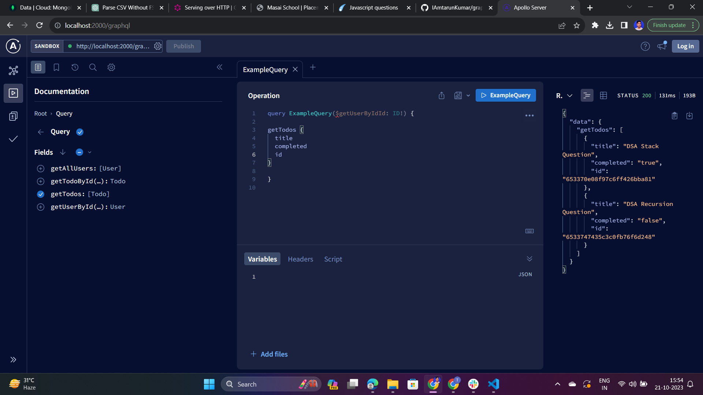
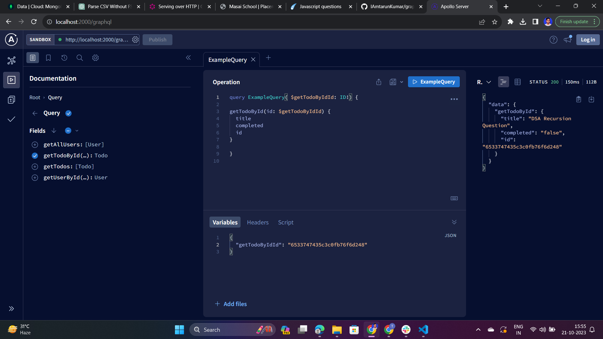
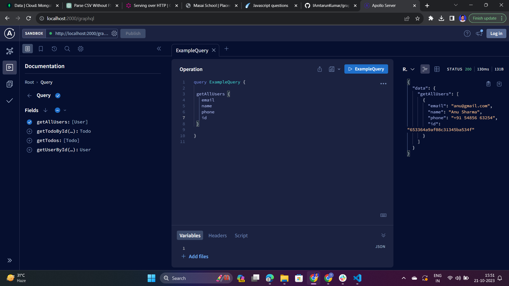
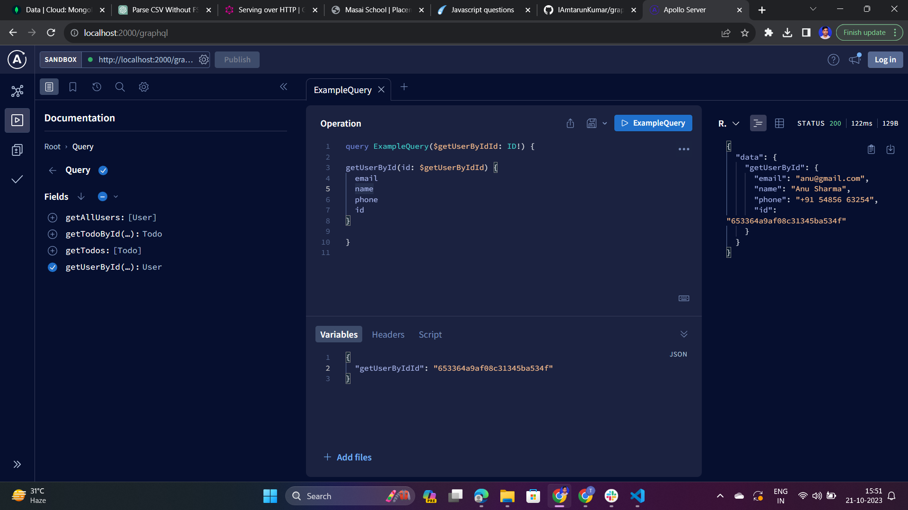
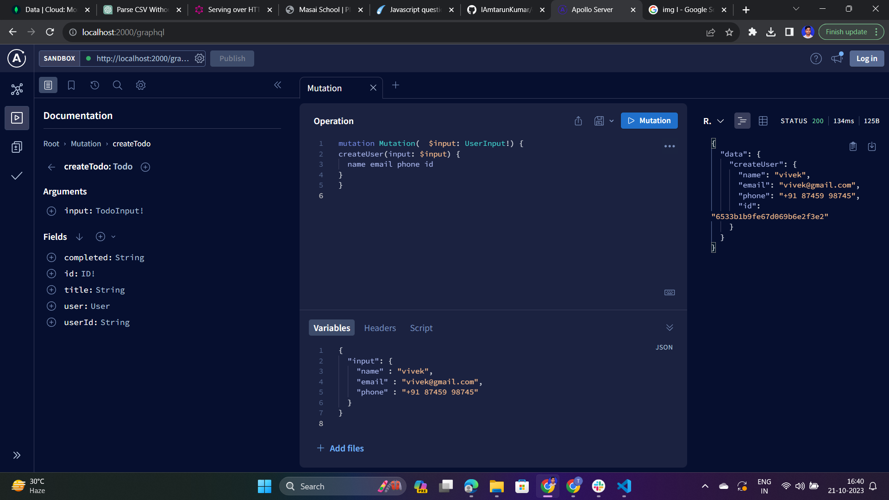
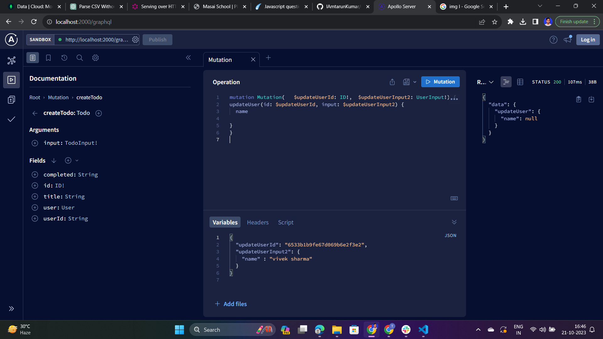
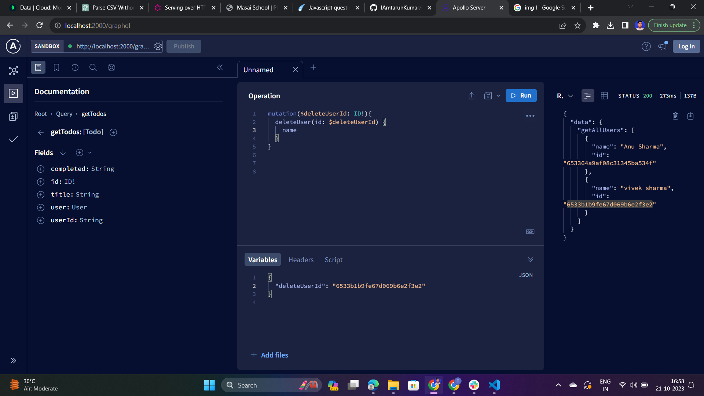
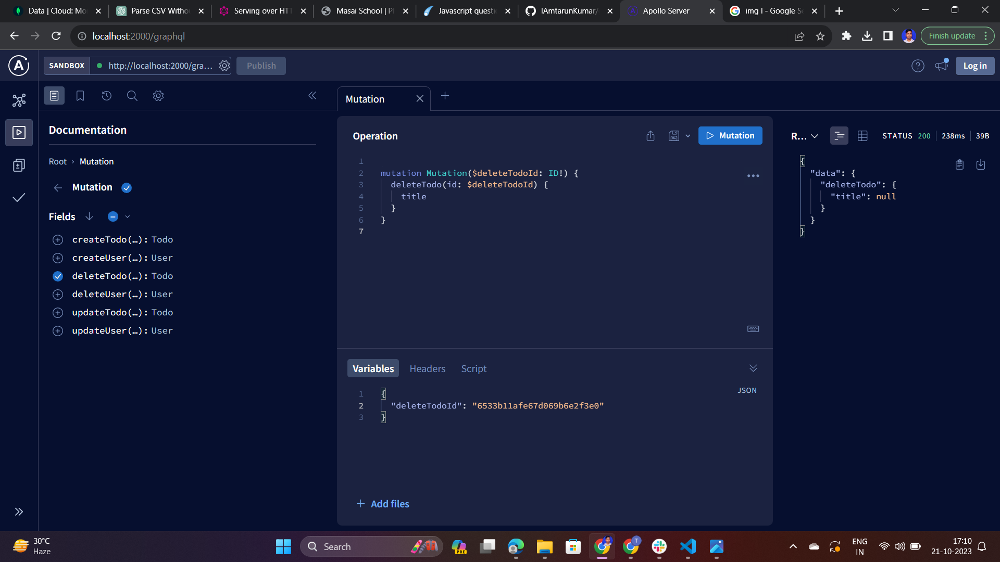

# GraphQL Server

This is a simple GraphQL server built using Apollo Server, MongoDB, and Mongoose. The server provides APIs for managing users and todos.

## Features

- Create, Read, Update, and Delete Users
- Create, Read, Update, and Delete Todos
- Fetch all Todos with associated User data
- Error handling and validation

## Getting Started

### Prerequisites

- Node.js (>=12.0.0)
- MongoDB

### Installation

1. Clone this repository:

   ```bash
   git clone https://github.com/IAmtarunKumar/graphQL_CRUD.git


2. Install dependencies:

   ```bash
   npm install

3. Run server:

   ```bash
   npm run server

4. Run server:

   ```bash
   Access the GraphQL playground at : http://localhost:{Your_Port}/graphql


## Features

- **User Schema**
  - `id`: User ID
  - `name`: User's name
  - `email`: User's email
  - `phone`: User's phone number
  - `userId`: User's unique identifier

- **Todo Schema**
  - `id`: Todo ID
  - `userId`: User ID associated with the Todo
  - `title`: Todo title
  - `completed`: Todo completion status
  - `user`: User data associated with the Todo

## Queries



- `getTodos`: Retrieve all Todos.  
  Sample Query:
  ```graphql
  query {
    getTodos {
      id
      title
      completed
    }
  }
- `getTodos`: Retrieve all Todos.

<hr>




- `getTodoById(id: ID!)`: Retrieve Todo by ID.  
  Sample Query:
  ```graphql
  query ExampleQuery( $getTodoByIdId: ID!) {
    getTodoById(id: $getTodoByIdId) {
    title
    completed 
    id
    }
 
}
  
- `getTodoById(id: ID!)`: Retrieve a Todo by its ID.
<hr>




- `getAllUsers`: Retrieve all users.  
  Sample Query:
  ```graphql
  query ExampleQuery {
    getAllUsers {
    email
    name
    phone
    id
    }
 
}
- `getAllUsers`: Retrieve all Users.

<hr>



- `getUserById(id: ID!)`: Retrieve user by ID.  
  Sample Query:
  ```graphql
        query ExampleQuery($getUserByIdId: ID!) {
        getUserById(id: $getUserByIdId)
        {
        name
        email
        phone 
        id
        }
 
}
  
- `getUserById(id: ID!)`: Retrieve a User by their ID.

## Mutations



- `createUser`: Create User.  
  Sample Query:

  ```graphql
  mutation Mutation(  $input: UserInput!) {
    createUser(input: $input) {
    name email phone id
    }
    }


- `createUser(input: UserInput!)`: Create a new User.


<hr>


- `updateUser`: Update User.  
  Sample Query:

  ```graphql
  mutation Mutation(   $updateUserId: ID!,  $updateUserInput2: UserInput!) {
    updateUser(id: $updateUserId, input: $updateUserInput2) {
    name

    }
    }

- `updateUser(id: ID!, input: UserInput!)`: Update a User.
<hr>



- `deleteUser`: Delete User.  
  Sample Query:

  ```graphql
  mutation($deleteUserId: ID!){
  deleteUser(id: $deleteUserId) {
    name
        }
    }


- `deleteUser(id: ID!)`: Delete a User.
<hr>


- `createTodo`: Create Todos.  
  Sample Query:

  ```graphql
  mutation Mutation($input: TodoInput!) {
  createTodo(input: $input) {
    title
    completed
    userId
  }
}

- `createTodo(input: TodoInput!)`: Create a new Todo.
<hr>


- `updateTodo`: Update todo.  
  Sample Query:
  ```graphql
    mutation Mutation( $updateTodoId: ID!, $input: TodoInput!) {
    updateTodo(id: $updateTodoId, input: $input) {
    title
 }
}


- `updateTodo(id: ID!, input: TodoInput!)`: Update a Todo.
<hr>




- `deleteTodo`: delete Todos.  
  Sample Query:
  ```graphql
        mutation Mutation($deleteTodoId: ID!) {
        deleteTodo(id: $deleteTodoId) {
            title
  }
}


- `deleteTodo(id: ID!)`: Delete a Todo.
<hr>

## Error Handling

All mutations have proper error handling to provide meaningful error messages.


 

